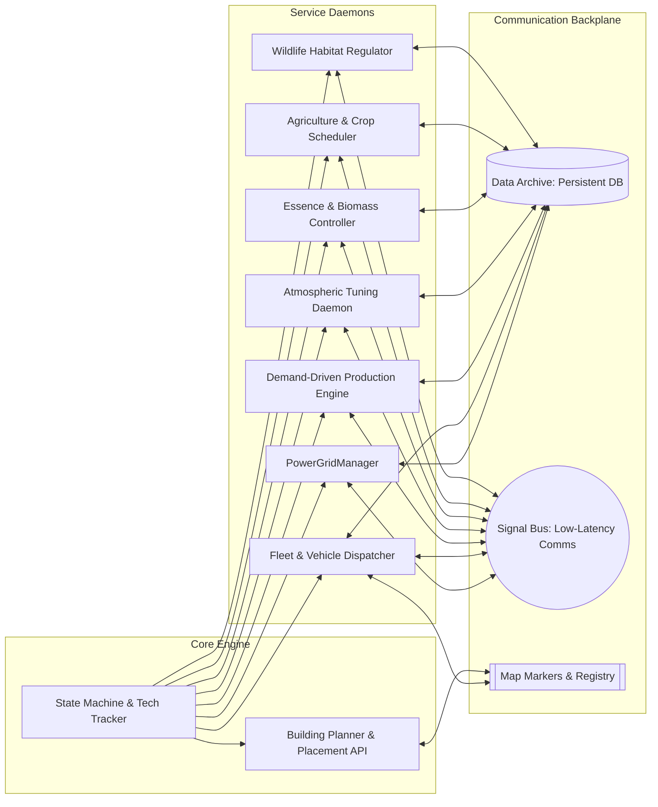

# Code: Terraform — Autonomous Architecture & Early Speedrunner (`auto_walkthrough.md`)

This document is the technical blueprint and operational manual for the **Autonomous Automation Architecture**, the **0 $\rightarrow$ 150k TP Speedrun Strategy**, and the **`tools/early_game.py` Orchestrator**.

---

## 🤖 Part 1: Master Automation Architecture

When deploying the full planetary player daemon, structure it around decoupled, event-driven components communicating over the game's native hardware backplanes:



### Architectural Self-Healing Invariants:
1. **Dynamic Capability Probing**: Check `hasattr()` or `caps` before invoking newly researched features.
2. **Atomic Fleet Leases**: Vehicles lease mining sectors and construction sites via `archive.transaction("rover.claims", ...)` with heartbeats to prevent route collisions.
3. **There-and-Back Battery Safety**: Never dispatch a vehicle unless:
   $$\text{battery\_wh} \ge (\text{return\_cost} \times \text{safety\_margin}) + \text{emergency\_reserve}$$
4. **Single-Specimen Pipeline Locks**: In biology and farming, hold input queues until downstream processors are idle (`is_idle()`) to prevent unstackable specimen backlogs from exhausting storage slots.
5. **Fluid Deadlock Blacklisting**: If a fluid route records zero flow for consecutive cycles while the destination has capacity, blacklist the connection and switch to an alternate buffer tank.

---

## ⚡ Part 2: Revised Speedrun Strategy (0 $\rightarrow$ 150,000 TP)

The speedrun strategy optimizes the 25-slot Nocturna Base building sequence from cold boot to the **150,000 TP Mid-Game Transition**, guaranteeing **zero brownouts**, strict **25/25 slot occupancy (0% over-capacity penalty)**, and zero wasted credits.

### The Key Architectural Optimization: Oxygen First $\rightarrow$ Pressure $\rightarrow$ Heat

In Code: Terraform, ground vehicles (`rover`, `drill_module`) unlock at **0.200 kPa Pressure**, but **cannot recharge without a Vehicle Charging Station (Oxygen 9.0 ppt)** and **cannot unload cargo without Auto Feeders (Oxygen 1.0 ppt)**. Deploying Rovers at 0.200 kPa before Oxygen results in stranded rovers sitting dead in the dirt with 0 Wh.

Furthermore:
1. **Batteries Arrive Pre-Charged**: Small Batteries arrive from the Shop pre-charged with $500\text{ Wh}$ (+1,000 Wh instant buffer from 2 starter batteries).
2. **Day/Night Cycle Physics**: A day is 13.92h of daylight and 10.08h of night. To continuously power baseload 24/7 without dusk-to-dawn brownouts, the optimal power anchor is **6 Solar Panels + 3 Small Batteries** (~2:1 to 2.5:1 ratio).
3. **Zero Atmospheric Gas Decay**: Gas once created does not leak, decay, or dissipate. When 9.0 ppt $\text{O}_2$ is achieved, all 13 Oxygen Generators can be **100% recycled** down to 0, recovering all 13 slots and liquid credits.
4. **Pressure Gauge Resonance Sweep**: Pressure Generators use a cyclical resonance gauge. Calling `self.sync()` inside the window grants +25% efficiency; missing penalizes -10%. It takes ~4 sweeps to ramp from 0 to 100% efficiency.

Therefore, the optimal speedrun line is **Oxygen Rush (to 9.0 ppt) $\rightarrow$ Pressure Rush (to 0.200 kPa) $\rightarrow$ Heat Rush (to 12.0 HU)**:

```mermaid
flowchart TD
    Phase0["Phase 0: Power Grid Anchor<br/>3 Batteries + 6 Solar (Total 1,500 Wh buffer / ~122W continuous)<br/>*Batteries arrive pre-charged with 500 Wh each (+1,000 Wh instant buffer!)*"]
    Phase1["Phase 1: Oxygen Rush to 9.0 ppt (Exact 25/25 slots)<br/>6 Solar + 3 Batteries + 3 Bio-Loop + 13 O2 Generators<br/>1.0 ppt: Auto Feeders & Bio-Loop Power ON (Biomass TP + Credits)<br/>3.0 ppt: Earth Clearance Contracts (+22,500 cr)<br/>5.0 ppt: Smelter Unlocked<br/>9.0 ppt: Vehicle Charging Station Unlocked! Deploy Charger 1"]
    Phase2["Phase 2: Pressure Rush to 0.200 kPa (Exact 25/25 slots)<br/>Recycle all 13 O2 Gens to 0 (0% gas decay!) -> Deploy Charger 1 + 12 Pressure Gens<br/>*Pressure gauge resonance sync ramps up to 100% in ~4 sweeps*<br/>0.200 kPa: Rover Chassis & Drill Unlocked!<br/>Deploy 2 Rovers + Smelter 1<br/>*Rovers mine, auto-unload via Auto Feeders & recharge at Charger with 0% stranding!*"]
    Phase3["Phase 3: Heat Rush to 12.0 HU (Strict 25/25 Slots)<br/>Recycle 11 Pressure Gens -> Deploy 7 Heaters<br/>Scale Power: 7 Solar + 4 Batteries (2,000 Wh reserve)<br/>Dynamic night-battery heater throttling (<25%)"]
    Phase4["Phase 4: 100k TP Breakout<br/>Tri-Pillar complete (0.2P + 9.0 O2 + 12.0 HU = ~98.6k TP + Bio = 100k TP)<br/>Fabricate Pioneer Chassis + Modular Cargo Racks + Constructor"]
    Phase5["Phase 5: 150k TP Modular Architecture Migration<br/>Copy lib/ -> Swap standalone templates for Bus/Archive ecosystem"]

    Phase0 --> Phase1 --> Phase2 --> Phase3 --> Phase4 --> Phase5
```



### 2.1 Atmospheric Milestone Targets & Tech Unlocks

Research trees show prerequisites, but physical progression requires strict phase gates:

| Phase | Milestone | Tech Gate Unlocked | System Action Taken |
|---|---|---|---|
| **Phase 0** | **0 TP** | Power & Sensors Online | Deploy 1 Battery + 1 Solar early, then scale to 3 Batteries + 6 Solar Panels (1,500 Wh buffer / ~122W continuous). Solve intro Earth contracts (+3,750 cr). |
| **Phase 1** | **1.0 ppt $\text{O}_2$** | Auto Feeders (`research_auto_feeders`) | **Power ON Bio-Loop**: Collector, Lab, and Exchange now have container transfer support. Generates Biomass TP & Credits on Day 1! |
| **Phase 1** | **3.0 ppt $\text{O}_2$** | Earth Clearance (`research_earth_clearance`) | Solve 3 advanced Earth contracts (`sealed_vault`, `terminal_breach`, `data_tablet`) for **+22,500 cr**. |
| **Phase 1** | **5.0 ppt $\text{O}_2$** | Ore Refinement (`research_smelter`) | Smelter unlocked in shop (650 cr). |
| **Phase 1** | **9.0 ppt $\text{O}_2$** | Vehicle Charging Station (`research_charging_station`) | Deploy **Vehicle Charging Station 1** (1,200 cr). Fleet charging active! |
| **Phase 2** | **0.200 kPa** | Mining Operations, Rover Chassis (`research_rover`), Drill (`research_deep_extraction`) | Recycle all 13 $\text{O}_2$ Gens down to 0 (0% decay). Deploy **12 Pressure Generators** (72W load, 25/25 slots). Resonance sync ramps to 100% in ~4 sweeps. At 0.200 kPa, deploy **2 Rovers** + **Smelter 1**. Rovers immediately mine, auto-unload to inventory, and recharge with **zero stranding**. |
| **Phase 3** | **12.0 HU Heat** | Small Battery Holder (`research_battery_holder_small`) | Recycle 11 Pressure Gens down to 1. Scale to 7 Solar + 4 Batteries; deploy **7 Heaters** (exact 24-25 slots). Hits 12.0 HU in ~5–6 days. |
| **Phase 4** | **100,000 TP** | Pioneer Chassis (`research_pioneer`) | Tri-Pillar complete (~98.6k TP + Bio-Loop = **100,000 TP**). Assemble Pioneer with Constructor Module + Outpost Kit. |
| **Phase 5** | **150,000 TP** | Full Mid-Game Modular Architecture | `trigger_midgame_migration()` copies `lib/`; machine scripts swap to Signal Bus & Data Archive controllers. |

---

### 2.2 Nocturna Base Slot & Power Accounting (Strict 25 Slots, 0% Penalty)

Exceeding 25 base buildings triggers the engine's soft threshold penalty (e.g. 27/25 runs all base machines at -20% efficiency). The speedrun path enforces strict $\le 25/25$ limits:

1. **Power Infrastructure**:
   - **Tracked Solar Panel**: $50\text{ W}$ daytime peak, elevation-tracked (~487 Wh/day).
   - **Small Battery**: $500\text{ Wh}$ capacity ($10.08\text{ h}$ night duration), arrives pre-charged from shop.
2. **Fixed Non-Power Baselines**:
   - **Bio-Loop (3 slots, 18 W continuous)**: Bio Collector ($5\text{ W}$) + Bio Lab ($5\text{ W}$) + Bio Exchange ($8\text{ W}$).
   - **Vehicle Charging Station (1 slot, 0–30 W)**: $0\text{ W}$ idle, $30\text{ W}$ during vehicle recharge.
   - **Smelter (1 slot, 0–25 W)**: $0\text{ W}$ idle, $25\text{ W}$ active crafting.
3. **Exact Slot Allocations Across Phases**:
   - **Phase 0 Power Anchor**: 6 Solar + 3 Batteries + 3 Bio + starter units = **12–15 slots**.
   - **Phase 1 Oxygen Rush**: 6 Solar + 3 Batteries + 3 Bio + 13 $\text{O}_2$ Gens = **EXACTLY 25 / 25 SLOTS** (0% penalty!).
     - Load: 15W Base + 18W Bio + 104W (13 O2) = 137W peak / ~122W normal. Night load: 1,229.8 Wh (3 Batteries have 1,500 Wh buffer $\rightarrow$ 270.2 Wh / 18% reserve at dawn).
   - **Phase 2 Pressure Rush**: 6 Solar + 3 Batteries + 3 Bio + 1 Charging Station + 0 $\text{O}_2$ + 12 Pressure Gens = **EXACTLY 25 / 25 SLOTS** (0% penalty!).
     - Load: 15W Base + 18W Bio + 10W Charger + 72W (12 Pressure) = 115W peak / ~100W normal. Night load: 1,008 Wh (3 Batteries have 1,500 Wh buffer $\rightarrow$ 492 Wh / 32% reserve at dawn).
     - Resonance ramp: ~4 sweeps to hit 100% sync output.
   - **Phase 3 Heat Rush**: 7 Solar + 4 Batteries + 3 Bio + 1 Charging Station + 1 Smelter + 1 Pressure + 7 Heaters = **24 SLOTS** (1 spare slot for flex or 8th Heater!).
4. **Field Units (0 Base Slots)**:
   - **2 Rovers**: Both equipped with Nav + Sonar + Drill modules. Mobile units do not consume base capacity.
   - **1 Harvester + 1 Scanner**: 0 slots.
5. **Night Power Budget & Dynamic Throttling**:
   - 4 Batteries = **2,000 Wh** reserve.
   - Continuous baseload: 15W Atmo + 18W Bio + 84W (7 Heaters) = **117 W**.
   - Night consumption: $117\text{ W} \times 10.08\text{ h} = 1,179.4\text{ Wh}$ ($820.6\text{ Wh}$ surplus buffer for Rover charging).
   - Heaters dynamically throttle to 1W if battery drops below **25%**, preventing brownouts under any surge.
---

## 🛠️ Part 3: Master Building Buyer (`solar_1.py`)

The in-game buyer script runs inside the master solar panel (`solar_1.py`), eliminating the need for human building purchases:

### 3.1 Dynamic Master Election
All solar panels execute the sun tracking loop (`self.set_tilt(elevation)`). To prevent purchase race conditions, only the panel with the minimum ID index activates the buyer logic:
```python
home = get_component("outpost_home")
solars = home.buildings("solar_generator")
solar_ids = sorted([b.id for b in solars])
min_solar_id = solar_ids[0] if solar_ids else "solar_1"

if self.id != min_solar_id:
    # Worker panel: runs elevation tracking only
    sleep(2.0)
    continue
```

### 3.2 Tech-Guarded Purchases & Sales
Every purchase and deployment is strictly guarded against runtime crashes:
```python
def safe_buy_and_deploy(computer, item_id, count, required_tech=None):
    if required_tech and not research.is_unlocked(required_tech):
        return False
    price = shop.get_price(item_id)
    if player.credits < price * count:
        return False
    shop.buy(item_id, count)
    computer.deploy(item_id)
    return True
```

---

## 🚀 Part 4: The `tools/early_game.py` Orchestrator

The `tools/early_game.py` script automates save discovery, First Contact onboarding, Earth contracts, machine template deployment, real-time error repair, and telemetry monitoring.

### 4.1 CLI Execution Modes
```bash
# First Contact onboarding (boot, power, sensors, uplink, calibrations):
python tools/early_game.py --onboarding

# Solve the 3 intro Earth contracts (+3,750 credits):
python tools/early_game.py --contracts

# Scan and deploy early templates to unscripted or errored machines:
python tools/early_game.py --scan

# Print the live speedrun dashboard once:
python tools/early_game.py --advisor

# Full automated speedrun daemon (monitors metrics and auto-deploys new machines):
python tools/early_game.py --auto
```

### 4.2 Why Semi-Automation is Necessary (The UI Initialization Constraint)
In the *Code: Terraform* game engine, certain hardware components, sensor calibration tests, and Earth contract puzzle instances **are not instantiated or exposed in the game data structures until the player opens or clicks that specific UI tab in-game**:
- **Sensor Calibration**: The game engine does not create `pressure_sensor.py` or initialize the 5-point test suite for `oxygen_sensor.py` until the player clicks the sensor on the Base Overview map.
- **Contract Puzzles**: The contract state machine and the script documents for Earth contracts (e.g. `relay_hack.py`, `xenogenetics.py`, `sealed_vault.py`) remain completely dormant until the player navigates to the in-game "Contracts" tab.

`early_game.py` solves this elegantly via a **semi-automated synchronization protocol**:
1. It queries `codeterraform-workspace.json` and active session documents.
2. If the document slot is missing, it prints a prompt instructing the user to click the tab/sensor in the in-game UI.
3. It polls the workspace until registration appears, then **instantly takes over full autonomous control**: writing the optimal algorithmic solver, launching the execution, waiting for Earth transmission acceptance, and verifying completion.

---

### 4.3 Early Earth Contract Solvers (~26,250 Total Credits)

Earth contracts provide massive non-dilutive starter capital. `early_game.py` reads modular solver scripts from `tools/contracts/` and executes them across both early tiers:

#### Tier 1: Intro Earth Contracts (Unlocked at 0 TP / Cold Boot — +3,750 cr)
- **Orbital Relay Hack (`tools/contracts/relay_hack.py` — +1,250 cr)**:
  - **Mechanic**: Sequential tumbler lock with intercept feedback.
  - **Algorithm**: Tests tumbler values $0 \dots K-1$ per position sequentially ($O(N \times K)$ complexity), recording locked pins as feedback confirms each digit.
- **Xenogenetics Survey (`tools/contracts/xenogenetics.py` — +1,250 cr)**:
  - **Mechanic**: Filter foreign alien life forms from reference Earth genome sets.
  - **Algorithm**: Computes set difference `[s for s in samples if s not in earth_ref]` and transmits alien sample identifiers.
- **Corrupted Archive (`tools/contracts/corrupted_archive.py` — +1,250 cr)**:
  - **Mechanic**: 2D memory-matching puzzle across encrypted archive sectors.
  - **Algorithm**: Traverses rows and columns, flips cards with `arch.flip(r, c)`, records word locations in a hash map, pairs coordinates of identical words, and transmits all pairs.

#### Tier 2: Earth Clearance Contracts (Unlocked at 3.0 ppt $\text{O}_2$ — +22,500 cr)
- **Sealed Vault (`tools/contracts/sealed_vault.py` — +10,000 cr)**:
  - **Mechanic**: Blind maze navigation from $(0, 0)$ to $(N-1, N-1)$ to extract a cryptographic escape key.
  - **Algorithm**: Depth-First Search (DFS) with recursive backtracking. Moves south, east, north, west; detects walls and paths; upon reaching exit cell, calls `vault.escape()` to extract the key and transmits to Earth.
- **Alien Terminal Breach (`tools/contracts/terminal_breach.py` — +7,500 cr)**:
  - **Mechanic**: Cryptographic Mastermind game across a 15-digit passcode (values 1–5).
  - **Algorithm**: Starts with baseline guess `[1]*15`. For each position, tests candidate digits $2 \dots 5$:
    - If `correct == current + 1`: digit is confirmed.
    - If `correct == current - 1`: previous digit (1) is confirmed without needing to test higher numbers!
    - Solves full 15-digit code in $<35$ queries.
- **Underground Data Tablet (`tools/contracts/data_tablet.py` — +5,000 cr)**:
  - **Mechanic**: Radar probing of a buried alien tablet containing hidden characters.
  - **Algorithm**: Sweeps grid coordinates $(r, c)$ using `tablet.probe(r, c)`. When `distance == 0`, a message character is located. Sorts located characters in standard reading order (row-major: top-to-bottom, left-to-right), concatenates string, and transmits to Earth.

*Combined Early Contract Yield: **~26,250+ credits**, single-handedly financing all 10 Pressure Gens, 12 Oxygen Gens, 4 Batteries, Smelter, Vehicle Charging Station, and 2x Rover chassis with zero reliance on manual scavenging.*

> [!TIP] **Continuous Contract Watcher (`scan_and_solve_contracts`)**:
> `early_game.py` monitors `codeterraform-workspace.json` in the background daemon loop. As soon as the player clicks any contract in the in-game Contracts tab, the watcher detects the newly registered document slot, immediately writes the corresponding solver code from `tools/contracts/`, and executes it in-game via the command bridge. Both Intro and Earth Clearance contracts solve autonomously in seconds!

---


### 4.4 Modular Codebase Architecture (`tools/onboarding` & `tools/contracts`)
To avoid monolithic multi-thousand-line script files, `early_game.py` decouples orchestration from execution scripts:
- **`tools/onboarding/`**: Contains standalone first-contact automation files (`boot.py`, `planet_power.py`, `planet_sensors.py`, `uplink.py`, `pressure_sensor.py`, `oxygen_sensor.py`).
- **`tools/contracts/`**: Contains dedicated solver scripts (`relay_hack.py`, `xenogenetics.py`, `corrupted_archive.py`, `sealed_vault.py`, `terminal_breach.py`, `data_tablet.py`).
- **`tools/templates/early/`**: Contains standalone early-game machine controllers for all hardware types before 150k TP.
- **`tools/early_game.py`**: Manages workspace detection, user prompts, command bridge hot-restarts, simulation synchronization, and deployment.

### 4.5 In-Game Command Bridge Protocol & CRLF Sync
Scripts are hot-restarted in-game via `.codeterraform/command.json`:
- **File Watcher SHA Parity**: On Windows, reading scripts in standard text mode translates `\r\n` to `\n`. Because the game engine's file watcher preserves CRLF, passing normalized `\n` causes `reason: "source_changed"`.
- **The Fix**: `restart_game_script()` reads on-disk files using `open(..., newline="")`, guaranteeing identical byte sequences. In-game restarts execute in $<100\text{ ms}$ with `ok: true`.

### 4.6 Machine Watcher & Auto-Repair Engine (`scan_and_deploy_machines`)
- **Self-Contained Early Templates**: Before 150k TP, machines run standalone code from `tools/templates/early/` (no `lib/` imports).
- **Real-Time Repair**: If newly deployed machines spawn with game-default stubs importing `terraforming` or crash with `status: "error"`, the watcher immediately overwrites them with the proper early template and hot-restarts them.
### 4.7 150k TP Architecture Migration (`trigger_midgame_migration`)
When `total_tp >= 150,000`:
1. Copies the complete `lib/` directory from reference sources to the active workspace.
2. Deploys `user_stubs.py` and supporting type definitions.
3. Switches template resolver `use_early = False`, enabling modular Signal Bus and Data Archive scripts across the entire planetary fleet.

### 4.8 Bio-Loop Automation Architecture & Biome Binding

The early Bio-Loop (`bio_collector`, `bio_lab`, `bio_exchange`) operates seamlessly on Day 1 starting at 1.0 ppt $\text{O}_2$:
- **Bootstrap Phase & Specimen Discarding**: The collector gathers up to 10 unknown specimens across the base's scan range. `bio_lab` runs `self.analyze()` to catalogue creature fragments in the planet journal and learn recipes for **0 reagent cost**. Specimens not needed by the active order are discarded via `self.discard()` to avoid paying reagent purchase costs on unneeded samples.
- **Outpost Biome Constraint**: Nocturna Base is in the **Frozen** biome (`self.outpost.biome == "frozen"`). `bio_collector.scan()` only discovers fragments native to the local biome. `bio_exchange.pick_order()` strictly filters candidate orders to match `self.outpost.biome` (e.g. `Frozen Tissue Consignment`), preventing unreachable orders from other biomes (such as Deep or Volcanic) from stalling the collector.
- **Deadlock-Free Fallback Chain**: `bio_collector` prioritizes active order requirements $\rightarrow$ explores unknown dots $\rightarrow$ rotates across cataloged dots as spare stock for the lab. This prevents modulo-based explore traps from permanently blocking collection when all local dots are cataloged.

