# Code: Terraform — Manual Progression Walkthrough (A $\rightarrow$ Z)

This document serves as the authoritative, chronological blueprint for understanding the complete planetary progression of **Code: Terraform** from boot to complete planetary victory (100% Terraform Index / 1,000,000 TP).

---

## 🎯 The Victory Condition: 1,000,000 TP (100.0%)

Nocturna is fully terraformed when the **Terraform Index reaches 1,000,000 TP**. Progress is strictly capped across six non-substitutable pillars:

| Pillar | Metric | Unit | Max Phase | Target Threshold | Index Share |
| :--- | :--- | :--- | :--- | :--- | :--- |
| **Temperature** | `heatUnits` | heat | *Springtime* | **360,000 heat units** | Atmosphere (70% / 700k TP combined) |
| **Oxygen** | `oxygen` | ppt | *Full Lungs* | **380,000 ppt** | Atmosphere (70% / 700k TP combined) |
| **Pressure** | `pressure` | kPa | *True Atmosphere* | **19,000 kPa** | Atmosphere (70% / 700k TP combined) |
| **Biomass** | `totalTons` | t | *Full Biosphere* | **250,000 t** | **10% (100,000 TP)** |
| **Plants** | `km2` | km² | *Continental* | **5,000,000 km²** | **10% (100,000 TP)** |
| **Wildlife** | `population` | ind. | *Teeming* | **5,000,000 individuals** | **10% (100,000 TP)** |

---

## 🔍 Critical Prerequisite Matrix & Bottlenecks

A linear read of the research tree is misleading because key technologies unlock before their physical crafting requirements can be satisfied.

```mermaid
graph TD
    classDef h1 fill:#2b3a4a,stroke:#4a90e2,stroke-width:2px;
    classDef h2 fill:#3d2b4a,stroke:#9013fe,stroke-width:2px;
    classDef fluid fill:#1f3a3d,stroke:#50e3c2,stroke-width:2px;
    classDef wet fill:#3a3821,stroke:#f5a623,stroke-width:2px;
    classDef drone fill:#1e3d2f,stroke:#7ed321,stroke-width:2px;

    H1["Iron & Silicon Mining<br/>Basic Sonar / Basic Drill"]:::h1 --> RefinedH1["Iron Ingots & Glass"]:::h1
    RefinedH1 --> Pipes["Gas & Liquid Pipes"]:::h1
    
    WideSonar["Wide Sonar: P 6.0 kPa"]:::h2 --> H2Mine["Titanium & Cobalt Mining<br/>Industrial Drill: O2 100 ppt"]:::h2
    H2Mine --> RefinedH2["Titanium & Cobalt Ingots"]:::h2
    
    RefinedH2 --> PowerLines["Power Line Segments"]:::h2
    RefinedH2 --> CapKit["Thermal Cap Kit"]:::h2
    Pipes --> CapKit
    CapKit --> Steam["Thermal Cap on Vent<br/>Steam Network Online"]:::fluid
    
    Hydro["Hydrology Survey: P 30 kPa"]:::fluid --> WaterPump["Water Pump<br/>Liquid Tanks"]:::fluid
    WaterPump --> Water["Water Flow Online"]:::fluid
    
    Water --> WetMfg["Wet Manufacturing:<br/>Circuit Panels, Machine Frames,<br/>Control Units, Battery Cells"]:::wet
    RefinedH2 --> WetMfg
    
    WetMfg --> Drones["Drone Depots & Drones<br/>TP 180,000"]:::drone
    Steam --> Drones
    RefinedH2 --> Drones
    
    Water --> Agriculture["Agriculture & Seed Maker<br/>Biomass 500 t / 2,000 t"]:::wet
    WetMfg --> Agriculture
    
    DeepSonar["Deep Sonar: P 60 kPa"]:::fluid --> Oil["Petroleum Survey: O2 1,500 ppt<br/>Oil Pump & Cracking"]:::fluid
    WetMfg --> Oil
    Oil --> Tar["Tar & Plastics"]:::fluid
    
    Tar --> Mk2Agri["Plant Terraformer Mk II<br/>Fertilizer & Accelerant"]:::wet
    Tar --> Exotics["Refined Exotic Fluids<br/>Wildlife Habitats"]:::wet
    
    HeavyDrill["Heavy Drill: O2 2,500 ppt"]:::h2 --> Neutronium["Neutronium H4 Mining"]:::h2
    Neutronium --> HabitatMk2["Habitat Mk II Packs<br/>Wildlife 600,000"]:::wet
    Tar --> HabitatMk2
    Steam --> HabitatMk2
    Water --> HabitatMk2
```



### Key Bottleneck Rules:
1. **Titanium Before Steam**: `craft_thermal_cap_kit` requires `2× Titanium Ingot`. Titanium is Hardness **H2** and requires **Wide Sonar** (Pressure 6.0 kPa) and **Industrial Drill** (Oxygen 100 ppt). Geothermal steam cannot be tapped before both thresholds are met.
2. **Water Before Electronics**: `circuit_panel`, `machine_frame`, `control_unit`, and `battery_cell` all require **piped Water** in their Fabricator recipes. No high-tier electronics can be crafted before **Hydrology Survey** (Pressure 30 kPa) and the first Water Pump.
3. **Steam + Water Before Drones**: Small Drones require Control Units (**Water**), Electric Thrusters (**Steam** + Turbine Rotor), and Cargo Pods (**Steam**). Drone aerial logistics require both fluid grids to be active.
4. **Oil/Tar Before Plant Mk II**: Plant Terraformer Mk II converts Forage at high speed using Fertilizer (`Tar + Glass + Water`) and Growth Accelerant (`Plastic [Oil] + Rare Earth + Water`). Oil cracking must be running before Mk II conversion can occur.
5. **Neutronium Before Habitat Mk II**: Upgrading Habitats to 350,000 capacity requires `craft_habitat_pack_mk2`, which consumes `Neutron Capacitor` (`1× Neutronium Bar` [H4]). Reaching 5,000,000 Wildlife requires edge-ring Neutronium mining with **Heavy Drills** (Oxygen 2,500 ppt).

---

## 📅 Chronological Master Roadmap (Phase 0 $\rightarrow$ Phase 7)

```
Phase 0: Cold Boot & Diagnostics (TP: 0 – 20k)
   │
Phase 1: Basic H1 Mining, Smelting & Early Tri-Pillar (TP: 20k – 100k)
   │
Phase 2: Heavy Manufacturing, H2/H3 Mining & Geothermal Power (TP: 100k – 150k)
   │   └─► Wide Sonar & Industrial Drill FIRST ──► Titanium ──► Thermal Cap & Steam
   │
Phase 3: Water Infrastructure, Satellite Outposts & Early Bio (TP: 150k – 180k)
   │   └─► Water Pump FIRST ──► Circuit Panels, Machine Frames, Batteries ──► Power Lines
   │
Phase 4: Aerial Drone Logistics & Biosphere Tier 1 Biomass (TP: 180k – 330k)
   │   └─► Steam + Water + Titanium ──► Drones ──► 35 Biosites ──► Essences ──► Biomass
   │
Phase 5: Oil Infrastructure, Agriculture & Plants Mk I (Plants: 0 – 1.25M km²)
   │   └─► Deep Sonar + Petroleum Survey ──► Oil & Tar ──► Crop Automators & Farming
   │
Phase 6: Plants Mk II, Wildlife Husbandry & Biome Scaling (Plants → 5M, Wildlife: 0 – 500k)
   │   └─► Tar/Plastic ──► Fertilizer/Accelerant ──► Habitats & Feed Makers
   │
Phase 7: Hardness-4 Edge Mining, Nuclear Era & 1,000,000 TP Completion
       └─► Heavy Drill & Neutronium ──► Habitat Mk II ──► Reactors & Mk IV ──► 100%
```

---

### Phase 0: Cold Boot & Foundations (TP: 0 – 20,000)
*Entry Condition: Fresh game start / save boot.*

- [x] **0.1 Sensors Online**:
  - Calibrate `oxygen_sensor.py` and `pressure_sensor.py`.
  - Read `thermometer` and initialize `atmosphere.get_heat()`.
- [x] **0.2 Day/Night Power Architecture**:
  - Deploy `solar_1.py` with continuous elevation tracking (`lib/solar.py`).
  - Deploy battery buffer; enforce tiered brownout load-shedding (`PowerGridManager` in `lib/power.py`).
  - Account for fixed day/night schedule: sunrise 6.0h, sunset 19.92h, night duration 10.08h.
- [x] **0.3 Atmospheric Genesis**:
  - Deploy `heater_1` (weather-adaptive dynamic power calibration).
  - Deploy `pressure_1` (resonance sweep sync window tracking).
  - Deploy `o2gen_1` (dynamic CO2 sweet-spot intake & clean waste purge).
- [x] **0.4 Capital Generation (Initial Earth Contracts)**:
  - Solve contracts for credits: `relay_hack.py`, `xenogenetics.py`, `corrupted_archive.py`, `sealed_vault.py`, `terminal_breach.py`, `data_tablet.py`.
- [x] **0.5 Research Unlocks**:
  - **Camera Feed** (5k TP) $\rightarrow$ **Ship Computer** (10k TP) $\rightarrow$ **Shared Library** (20k TP).

---

### Phase 1: Basic H1 Mining, Smelting & Early Tri-Pillar (TP: 20,000 – 100,000)
*Entry Condition: Shared Library unlocked; Tri-pillar atmospheric generators advancing concurrently.*

- [x] **1.1 Base Grid Harvesting**:
  - Run `harvester_1.py` (`lib/harvesting.py`) across local sectors A1..H24 to collect surface scrap.
- [x] **1.2 Rover H1 Mining Loop (Integrated Cargo)**:
  - Reach **Pressure 0.10–0.20 kPa**: Unlock Rover, Basic Nav, Basic Sonar, Basic Drill.
  - Deploy `rover_1` and `rover_2` (uses their **integrated 10-unit cargo hold**; Rovers do not require Cargo Racks).
  - *Speedrun note*: Rover field operations start as soon as the **Vehicle Charging Station** unlocks at **Oxygen 9.0 ppt**.
  - Survey and mine **Iron Ore** (H1) and **Silicon** (H1), offloading directly into Base Inventory.
  - Enforce atomic site reservations (`lib/vehicle_claims.py`) and there-and-back energy budgeting (`lib/vehicle_energy.py`).
- [x] **1.3 Ore Refinement & Storage Expansion**:
  - Reach **Oxygen 5 ppt**: Unlocks `smelter_1` (`lib/smelter.py`).
  - *Speedrun note*: In automated early play, Smelter deployment is deferred until **9.0 ppt $\text{O}_2$** (synchronized with Rover 1 & 2 deployment), allowing an extra $\text{O}_2$ generator to rush the 9.0 ppt milestone.
  - Refine mined Iron Ore into Iron Ingots and Silicon Ore into Silicon.
  - Apply soft-shedding to Smelter (idle is 0 W; pause crafts rather than cutting breaker power).
  - Reach **Temp 5**: Deploy **Storage Bins** (single-material stockpiles to relieve Base Inventory).
  - Reach **Temp 8**: Unlock **Small Cargo Racks** & Portable Bins (modular cargo hardware prepared for Pioneer deployment).
- [x] **1.4 Research Unlocks**:
  - **Signal Bus** (35k TP) $\rightarrow$ **Data Archive** (70k TP) $\rightarrow$ **Pioneer Chassis** (100k TP).

---

### Phase 2: Heavy Manufacturing, H2/H3 Mining & Geothermal Power (TP: 100,000 – 150,000)
*Entry Condition: Pioneer Chassis unlocked at 100k TP.*
*Rule: Titanium mining must precede Thermal Cap fabrication.*

- [x] **2.1 Pioneer Assembly & Constructor**:
  - Reach **Temp 10–12**: Unlock Constructor Module & Small Battery Holder.
  - Commission Pioneer chassis with Nav, Battery, Cargo Rack, and Constructor Module.
- [x] **2.2 Supply Dock Logistics & Campaign Unlocks**:
  - Reach **110k TP**: Deploy `supply_dock_1` (`lib/supply_dock.py`).
  - Fulfill contractor campaign orders:
    - **Helios, Iron Production** $\rightarrow$ Unlocks `craft_gas_pipe_segment` & `craft_gas_pipe_bridge`.
    - **Spire, Silicon Stock** $\rightarrow$ Unlocks `craft_liquid_pipe_segment` & `craft_liquid_pipe_bridge`.
- [x] **2.3 Heavy Fabrication (Dry Goods)**:
  - Reach **130k TP**: Deploy `fabricator_1` (`lib/fabricator.py`).
  - Fabricate Gas and Liquid Pipe Segments.
- [x] **2.4 Mid-Ring Hardness 2 & 3 Mining**:
  - Reach **Pressure 6.0 kPa** (*Wide Sonar*) + **Oxygen 100 ppt** (*Industrial Drill*).
  - Mount Wide Sonar and Industrial Drill on Pioneer.
  - Survey and mine **Titanium** (H2), **Cobalt** (H2), and **Rare Earth** (H3).
  - Smelt Titanium Ingots, Cobalt Ingots, and Rare Earth Cores.
  - Fulfill **Spire, Cobalt Run** $\rightarrow$ Unlocks `craft_pressure_valve`.
  - Fulfill **Vestibule, Utility Conduit Stock** $\rightarrow$ Unlocks `craft_power_line_segment`.
- [x] **2.5 Geothermal Steam Power Infrastructure**:
  - Reach **Pressure 2.0–3.0 kPa**: Geological Survey, Thermal Cap, Gas Tank, Steam Turbine.
  - Fabricate `craft_thermal_cap_kit` (`2× Titanium Ingot` + `2× Gas Pipe Segment`).
  - Pioneer builds Thermal Cap over surveyed thermal vent (`lib/thermal_cap.py`).
  - Connect Steam via Gas Tanks to Steam Turbines (`lib/steam_turbine.py`) $\rightarrow$ Continuous baseload power established.
- [x] **2.6 Warehouses & Control Room**:
  - Reach **Oxygen 150 ppt**: Deploy multi-material Warehouses (`lib/storage.py`).
  - Reach **140k–150k TP**: Unlock Cartography and Control Room (`panel_1.py`).

---

### Phase 3: Water Infrastructure, Satellite Outposts & Early Bio (TP: 150,000 – 180,000)
*Entry Condition: Geothermal power active; Pressure approaching 30 kPa.*
*Rule: Water Pump must precede Circuit Panels, Machine Frames, and Battery Cells.*

- [x] **3.1 Hydrology Network (The Wet Manufacturing Gate)**:
  - Reach **Pressure 30 kPa** (*Hydrology Survey*) + **Oxygen 400 ppt** (*Liquid Tank*).
  - Fabricate `craft_water_pump` (`2× Iron, 2× Glass, 4× Liquid Pipe` — no water required).
  - Pioneer builds Water Pump on surveyed Water Well (`lib/water_pump.py`). Pipe water into Liquid Tanks.
- [x] **3.2 Wet Electronics & Advanced Assemblies**:
  - With Water online, Fabricator crafts:
    - `circuit_panel` (`Iron + Glass + 1 t Water`).
    - `machine_frame` (`Iron + Titanium + 2 t Water`).
    - `control_unit` (`Circuit Panel + Titanium + Glass + 2 t Water`).
    - `battery_cell` (`Cobalt + Iron + Glass + 1 t Water`).
- [x] **3.3 Multi-Outpost Network**:
  - Reach **120k TP**: Purchase Outpost Kits. Found satellite outposts near remote ore veins and biomes.
  - Fabricate `craft_power_line_segment` (`Iron + Titanium`) and pipe segments; link outposts to base.
  - Deploy stationed mining Pioneers (`lib/outpost_mining.py`) and mixed-cargo transporter Pioneers (`lib/vehicle_cargo.py`).
- [x] **3.4 Staggered Biome Processors (First Wave)**:
  - **Coastal Outpost**: Reach **Temp 90** $\rightarrow$ Deploy Bio Luminizer (`lib/bio_coastal.py`, 3-lamp tinting).
  - **Volcanic Outpost**: Reach **Oxygen 350 ppt** $\rightarrow$ Deploy Bio Caster (`lib/bio_volcanic.py`, crucible casting).
  - Deliver coastal and volcanic Bio Orders to Bio Exchange.
- [x] **3.5 Atmospheric Mk II Fleet Upgrades**:
  - Upgrade Heaters to Mk II (Temp 80).
  - Upgrade Pressure Generators to Mk II (Pressure 1.2 kPa).
  - Upgrade Oxygen Generators to Mk II (Oxygen 75 ppt).

---

### Phase 4: Aerial Drone Logistics & Biosphere Tier 1 Biomass (TP: 180,000 – 330,000)
*Entry Condition: Water and Steam grids operational; TP reaches 180k.*
*Rule: Drones require Steam (Thrusters/Pods), Water (Frames/Controls), and Rare Earth.*

- [x] **4.1 Drone Fleet Infrastructure**:
  - Reach **180k TP** (*Basic Drone Operations*).
  - Fabricate `craft_drone_station_kit` (needs Frames, Controls, Water); build Drone Depots at outposts.
  - Fabricate Small Drones (`craft_drone_small`: Rare Earth, Titanium, Controls, Water).
  - Fabricate Drone Modules:
    - `craft_turbine_rotor` (`Titanium + Cobalt + Rare Earth + 4 t Steam`).
    - `craft_electric_thruster` (`Turbine Rotor + Rare Earth + 2 t Steam`).
    - `craft_cargo_pod_small` (`Titanium + Glass + 1 t Steam`).
    - `craft_battery_pack` (`Titanium + Glass + Battery Cell`).
- [x] **4.2 Biosphere Unlock & Planetary Biosurvey**:
  - Reach **210k TP** (*Biosphere*). Purchase Portable Bio Scanners and Portable Bio Extractors.
  - Fly scanner drones to all **35 permanent biological sites** (7 per biome across all 5 biomes) via `nocturna.points_of_interest()`.
  - Extractor drones harvest native fauna (25 t chamber); deliver specimens to corresponding biome outpost depots.
- [x] **4.3 Regional Liquifiers & Biomass Mixing**:
  - Deploy regional **Essence Liquifiers** at each biome outpost (Frozen, Coastal, Geothermal, Volcanic, Deep).
  - Pipe essences across outposts into central **Biomass Mixers**.
  - Run Biomass Mixers (`lib/biomass_mixer.py`) $\rightarrow$ produce planetary Biomass tons.
  - **Milestones**: 250 t Biomass $\rightarrow$ **500 t Biomass** (Unlocks Seed Maker) $\rightarrow$ **2,000 t Biomass** (Unlocks Plant Terraformer).

---

### Phase 5: Oil Infrastructure, Agriculture & Plants Mk I (Plants: 0 – 1.25M km²)
*Entry Condition: 500 t Biomass reached; Pressure approaching 60 kPa.*
*Rule: Harvester manual farming is required until Plants reaches 100k–620k km² for automated grid hardware.*

- [x] **5.1 Petroleum Survey & Oil Cracking**:
  - Reach **Pressure 60 kPa** (*Deep Sonar*) + **Oxygen 1,500 ppt** (*Petroleum Survey*) + **Temp 1,500** (*Oil Generator*).
  - Fabricate `craft_oil_pump` (Iron, Titanium, Pressure Valve, Circuit Panel).
  - Deploy Oil Pumps on surveyed oil wells; pipe Oil to base.
  - Deploy Oil Generators (700 W each) for high-density power.
  - Fabricate cracking recipes: `craft_tar`, `craft_plastic`, `craft_lubricant`, `craft_rubber`.
- [x] **5.2 Later Biome Processors**:
  - **Geothermal Outpost**: Reach **Pressure 120 kPa** $\rightarrow$ Deploy DNA Sequencer (`lib/bio_geothermal.py`, gene splicing).
  - **Deep Outpost**: Reach **Temp 1,200** $\rightarrow$ Deploy Bio Conditioner (`lib/bio_deep.py`, 5-stage QC rulebook).
- [x] **5.3 Seed Discovery & Manual Farming Phase (Plants: 0 – 100,000 km²)**:
  - Deploy **Seed Maker** (unlocked at 500 t Biomass). Run `combine(a, b, c)` across life forms to discover all **15 species seeds**.
  - Harvester manually loads seeds, plants, waters, lights, and salts cells on base grid.
  - Deploy **Plant Terraformer Mk I** (unlocked at 2,000 t Biomass); feed with Forage + Water.
- [x] **5.4 Field Automation Upgrades (Plants: 100k – 620k km²)**:
  - Plants reaches **100k km²**: Fabricate & deploy **Sprinklers** (piped Water).
  - Plants reaches **300k km²**: Fabricate & deploy **Dispensers** (Salt from Water Pump byproducts).
  - Plants reaches **500k km²**: Fabricate & deploy **Grow Lamps** (Light).
  - Plants reaches **620k km²**: Fabricate & deploy **Crop Automators** $\rightarrow$ Automated FIFO planting, treating, and harvesting.
  - Maximize the **Species Diversity Multiplier** (15× yield multiplier for all 15 active crops).

---

### Phase 6: Plants Mk II, Wildlife Husbandry & Biome Scaling (Plants $\rightarrow$ 5M km², Wildlife: 0 – 500k)
*Entry Condition: Plants reaches 1.25M km²; Oil cracking online.*
*Rule: Plant Terraformer Mk II requires Fertilizer & Growth Accelerant (needs Oil/Tar).*

- [x] **6.1 Plant Terraformer Mk II Upgrade**:
  - Reach **Plants 1,250,000 km²** (*Plant Terraformer Mk II*).
  - Fabricate Mk II upgrade packs (`Controls, Panels, Rare Earth, Valves, Water`).
  - Feed Mk II injectors with **Fertilizer** (`Tar + Glass + Water`) and **Growth Accelerant** (`Plastic + Rare Earth + Water`).
  - Push Plants through *Forests* (3.5M km²) to **5,000,000 km²** (*Continental* max cap).
- [x] **6.2 Wildlife Tier Unlock**:
  - Reach **Plants 2,250,000 km²** (*Wildlife*). Unlocks **Habitats** and **Feed Makers**.
  - Bio Lab catalogs all 5 DNA fragments per creature $\rightarrow$ unlocks feed recipes.
- [x] **6.3 Exotic Fluids & Refining**:
  - Reach **Wildlife 1,000** (*Exotic Husbandry*).
  - Fabricate Exotic Gas Caps and Exotic Spring Taps.
  - Deploy **Refiners**; refine raw exotics using **Tar** into Habitat fluids (Ammonia, Swamp Gas, Brine; later Sulfur Gas, Cryofluid, Chlorine, Quicksilver).
- [x] **6.4 Wildlife Breeding & Shared Insight**:
  - Deploy **Feed Makers**: craft feed from Forage + cross-biome life forms.
  - Deploy **Habitats**: stage feed and reagents; call `revive()`.
  - Maintain closed-loop regulation of gas and liquid bands (`required_gas()`, `gas_band()`, `required_liquid()`, `liquid_band()`).
  - Harvest shared Insight from population deltas; purchase 1-Insight **Adaptations** and 4-Insight **Breakthroughs** (at 10k pop).

---

### Phase 7: Edge Mining, Nuclear Era & 1,000,000 TP Completion (TP $\rightarrow$ 1,000,000)
*Entry Condition: Wildlife reaches 500k; Heavy Drill unlocked at Oxygen 2,500 ppt.*
*Rule: Habitat Mk II requires Neutronium (H4).*

- [x] **7.1 Edge-Ring Hardness-4 Mining**:
  - Reach **Oxygen 2,500 ppt** (*Heavy Drill*) + **Pressure 60 kPa** (*Deep Sonar*).
  - Equip Pioneer with Deep Sonar and Heavy Drill (sustained by 3-bay battery holders).
  - Mine edge-ring **Neutronium** (H4); smelt into Neutronium Bars.
  - Mine **Lead Ore** (H2); smelt into Lead Ingots; craft `craft_lead_plate`.
- [x] **7.2 Habitat Mk II & Final Biodiversity**:
  - Reach **Wildlife 500,000** (*Deep Exotics*) $\rightarrow$ **600,000** (*Habitat Mk II*).
  - Fabricate `craft_neutron_capacitor` (Neutronium, Cells, Controls, Rare Earth, Tar, Steam, Water).
  - Fabricate `craft_coolant_loop` (Pipes, Valves, Rare Earth, Titanium, Tar, Water).
  - Fabricate `craft_habitat_pack_mk2` (`2× Neutron Capacitor, 3× Rare Earth, 4× Controls, 3× Coolant, 6 t Water`).
  - Upgrade Habitats to Mk II (capacity 350,000); scale all 16 species into *Abundant* $\rightarrow$ **5,000,000 individuals** (*Teeming* max cap).
- [x] **7.3 Nuclear Power & Mk IV Atmospheric Fleet**:
  - Reach **Oxygen 3,000–8,000 ppt** (*Shielded Logistics / Shielded Depots*): Deploy Lead Casks; equip transport drones with Shield Plating to extract Raw Uranium.
  - Reach **Temp 10,000** (*Fuel Assembler*) + **650,000 TP** (*Nuclear Program*).
  - Fuel Assembler presses Raw Uranium + Lead into Fuel Rods.
  - Deploy Nuclear Reactors (5,000 W continuous).
  - Fabricate Mk IV Packs for Heaters (Temp 42,000), Pressure Generators (Pressure 2,000 kPa), and Oxygen Generators (Oxygen 40,000 ppt) $\rightarrow$ Fuel-Rod-driven output.
- [x] **7.4 Final Victory Verification**:
  - [x] Temperature: **360,000 heat units** (*Springtime*)
  - [x] Oxygen: **380,000 ppt** (*Full Lungs*)
  - [x] Pressure: **19,000 kPa** (*True Atmosphere*)
  - [x] Biomass: **250,000 t** (*Full Biosphere*)
  - [x] Plants: **5,000,000 km²** (*Continental*)
  - [x] Wildlife: **5,000,000 individuals** (*Teeming*)
  - **Terraform Index reads 1,000,000 TP (100.0%)** $\rightarrow$ Planet Fully Terraformed.

